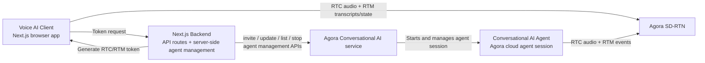

# Agora Conversational AI Next.js Quickstart

This is the official Agora Next.js quickstart for building a browser-based voice AI experience with Agora Conversational AI Engine.

## Run It

1. Create or sign in to your Agora account in [Agora Console](https://console.agora.io/).
2. In Agora Console, create a project and copy your `App ID` and `App Certificate`.
3. Clone this repository and install dependencies.
4. Copy `env.local.example` to `.env.local`.
5. Set `NEXT_PUBLIC_AGORA_APP_ID` and `NEXT_AGORA_APP_CERTIFICATE`.
6. Run `pnpm dev`.
7. Open `http://localhost:3000`.

```bash
git clone https://github.com/AgoraIO-Conversational-AI/agent-quickstart-nextjs.git
cd agent-quickstart-nextjs
pnpm install
cp env.local.example .env.local
pnpm dev
```

Required environment variables:

- `NEXT_PUBLIC_AGORA_APP_ID` from your Agora Console project
- `NEXT_AGORA_APP_CERTIFICATE` from your Agora Console project

The default agent configuration in [`app/api/invite-agent/route.ts`](app/api/invite-agent/route.ts) uses Agora-managed vendor presets for STT, LLM, and TTS, so no additional vendor API keys are required to run the base quickstart.

## What This Repository Includes

- a Next.js App Router frontend for joining an Agora RTC channel from the browser
- RTM-based live transcripts and agent state updates
- a Next.js backend for token generation and agent lifecycle management
- an Agora cloud agent that joins the same channel and runs the voice experience
- Agora-managed default STT, LLM, and TTS configuration, with optional BYOK examples

## How It Works

When a user starts a session, the app:

1. generates an RTC + RTM token from the Next.js backend
2. invites an Agora Conversational AI agent from the backend
3. joins the browser client to the Agora channel for audio
4. receives live transcript and state events over RTM
5. stops the agent and cleans up the session when the conversation ends

## Guides and Documentation

- [Guide.md](./DOCS/GUIDE.md) - step-by-step build guide
- [Text Streaming Guide](./DOCS/TEXT_STREAMING_GUIDE.md) - transcript and RTM flow details

## Prerequisites

- [Node.js](https://nodejs.org/) (version 22.x or higher)
- [pnpm](https://pnpm.io/) (version 8.x or higher)
- [Agora Console account](https://console.agora.io/)

## Quickstart

1. Create a project in [Agora Console](https://console.agora.io/) and copy the `App ID` and `App Certificate`.

2. Clone the repository.

```bash
git clone https://github.com/AgoraIO-Conversational-AI/agent-quickstart-nextjs.git
cd agent-quickstart-nextjs
```

3. Install dependencies.

```bash
pnpm install
```

4. Create `.env.local`.

```bash
cp env.local.example .env.local
```

5. Set the required Agora credentials.

- `NEXT_PUBLIC_AGORA_APP_ID` - Your Agora App ID
- `NEXT_AGORA_APP_CERTIFICATE` - Your Agora App Certificate

You can find `App ID` and `App Certificate` in your project settings in [Agora Console](https://console.agora.io/).

The default agent configuration in [`app/api/invite-agent/route.ts`](app/api/invite-agent/route.ts) uses Agora-managed vendor presets for STT, LLM, and TTS, so no additional vendor API keys are required for the base quickstart.

6. Start the development server.

```bash
pnpm dev
```

7. Open `http://localhost:3000`.

## Optional BYOK Configuration

Optional BYOK examples remain commented in [`app/api/invite-agent/route.ts`](app/api/invite-agent/route.ts). Uncomment those only if you want to provide your own vendor credentials such as:

- `NEXT_LLM_URL` and `NEXT_LLM_API_KEY`
- `NEXT_DEEPGRAM_API_KEY`
- `NEXT_ELEVENLABS_API_KEY` and `NEXT_ELEVENLABS_VOICE_ID`

## Deployment to Vercel

This repository is configured for one-click Vercel deployment.

[](https://vercel.com/new/clone?repository-url=https%3A%2F%2Fgithub.com%2FAgoraIO-Conversational-AI%2Fagent-quickstart-nextjs&project-name=agent-quickstart-nextjs&repository-name=agent-quickstart-nextjs&env=NEXT_PUBLIC_AGORA_APP_ID,NEXT_AGORA_APP_CERTIFICATE&envDescription=Agora%20credentials%20needed%20to%20run%20the%20app&envLink=https%3A%2F%2Fgithub.com%2FAgoraIO-Conversational-AI%2Fagent-quickstart-nextjs%23prerequisites&demo-title=Agora%20Conversational%20AI%20Next.js%20Quickstart&demo-description=Official%20Next.js%20quickstart%20for%20building%20browser-based%20voice%20AI%20with%20Agora&demo-image=https%3A%2F%2Fraw.githubusercontent.com%2FAgoraIO-Conversational-AI%2Fagent-quickstart-nextjs%2Fmain%2F.github%2Fassets%2FConversation-Ai-Client.gif)

This will:

1. Clone the repository to your GitHub account
2. Create a new project on Vercel
3. Prompt you to fill in the required environment variables:
   - **Required**: Agora credentials (`NEXT_PUBLIC_AGORA_APP_ID`, `NEXT_AGORA_APP_CERTIFICATE`)
4. Deploy the application automatically

## Included in This Repo

### Frontend

- `app/page.tsx` renders the landing experience
- `components/LandingPage.tsx` starts the session, requests tokens, and logs RTM in
- `components/ConversationComponent.tsx` manages RTC join, mic publishing, agent state, and transcript rendering
- `components/MicrophoneSelector.tsx` handles input device selection

### Backend

- `app/api/generate-agora-token/route.ts` issues RTC + RTM tokens
- `app/api/invite-agent/route.ts` starts the agent session
- `app/api/stop-conversation/route.ts` stops the active agent session
- `app/api/chat/completions/route.ts` is an optional OpenAI-compatible custom LLM proxy

### Agora Packages

- `agora-agent-server-sdk` manages agent lifecycle from the server
- `agora-agent-client-toolkit` handles transcript and agent events in the browser
- `agora-agent-uikit` provides the conversation UI components
- `agora-rtc-react` and `agora-rtm` handle media and messaging transport

## API Endpoints

The application provides the following API endpoints:

### Generate Agora Token

- **Endpoint**: `/api/generate-agora-token`
- **Method**: GET
- **Query Parameters**:
  - `uid` (optional) - User ID (defaults to 0)
  - `channel` (optional) - Channel name (auto-generated if not provided)
- **Response**: Returns token (with RTC + RTM privileges), uid, and channel information

### Invite Agent

- **Endpoint**: `/api/invite-agent`
- **Method**: POST
- **Body**:

```typescript
{
  requester_id: string;
  channel_name: string;
  input_modalities?: string[];
  output_modalities?: string[];
}
```

### Stop Conversation

- **Endpoint**: `/api/stop-conversation`
- **Method**: POST
- **Body**:

```typescript
{
  agent_id: string;
}
```

## Runtime Details

### Transcript Flow

The text streaming feature uses `agora-agent-client-toolkit` with RTM for reliable real-time transcriptions:

1. **RTM Client** establishes a real-time messaging connection alongside RTC for audio
2. **`AgoraVoiceAI`** (from `agora-agent-client-toolkit`) subscribes to the RTM channel, processes transcript events, and emits `TRANSCRIPT_UPDATED`
3. **`ConversationComponent`** handles the event, remaps local user UIDs, and updates React state with separated in-progress and completed turns
4. **`ConvoTextStream`** (from `agora-agent-uikit`) renders the chat panel with smart scrolling and streaming indicators

Key points:

- dual RTC + RTM tokens are used for secure access to both transports
- audio PTS metadata is enabled for transcript timing accuracy
- turn detection is configured in the invite route
- the app cleans up RTC, RTM, and agent state when the conversation ends

### Audio Input

The MicrophoneSelector component provides:

- **Device enumeration** via `AgoraRTC.getMicrophones()`
- **Hot-swap detection** through `AgoraRTC.onMicrophoneChanged` callbacks
- **Seamless switching** using `localMicrophoneTrack.setDevice(deviceId)`
- **Automatic fallback** when the current device is disconnected

### Visualization

`AudioVisualizer` and `MicButtonWithVisualizer` (from `agora-agent-uikit`) use the Web Audio API:

- Connects to the Agora audio track's `MediaStream` via an `AnalyserNode`
- Uses `getByteFrequencyData()` to extract frequency information
- Animates visual bars using `requestAnimationFrame` for smooth 60fps updates

## Architecture

This quickstart uses a split media-plane and control-plane architecture:



The browser client and the cloud agent both connect to Agora's SD-RTN for the real-time audio and RTM data path. The Next.js backend stays on the control plane: it generates tokens and manages the agent lifecycle against Agora's service APIs. In this quickstart, the exposed routes cover invite and stop today, and the same backend layer is where update and list operations belong.

### RTC + RTM

- **RTC (Real-Time Communication)**: Handles high-quality audio streaming between users and AI agents
- **RTM (Real-Time Messaging)**: Delivers transcriptions, agent state updates, metrics, and error messages
- **Dual Token Authentication**: Single token provides secure access to both RTC and RTM services
- **Audio PTS Metadata**: Enables precise synchronization between audio playback and transcription display

### Agent Lifecycle

- **`agora-agent-server-sdk`**: starts and stops the cloud agent session from the Next.js backend
- **Invite Route**: configures the default STT, LLM, TTS, turn detection, and RTM-enabled agent behavior
- **Client Toolkit**: receives transcript, metrics, and state events after the agent joins the channel
- **Resource Cleanup**: the app stops the agent session and tears down RTC and RTM resources when the conversation ends

### Why It Is Structured This Way

- audio stays on Agora's real-time network instead of passing through your Next.js server
- the backend only handles token generation and agent control operations
- RTM carries transcripts, metrics, and agent state separately from the audio stream
- the client remains a standard browser app built with Next.js and React
